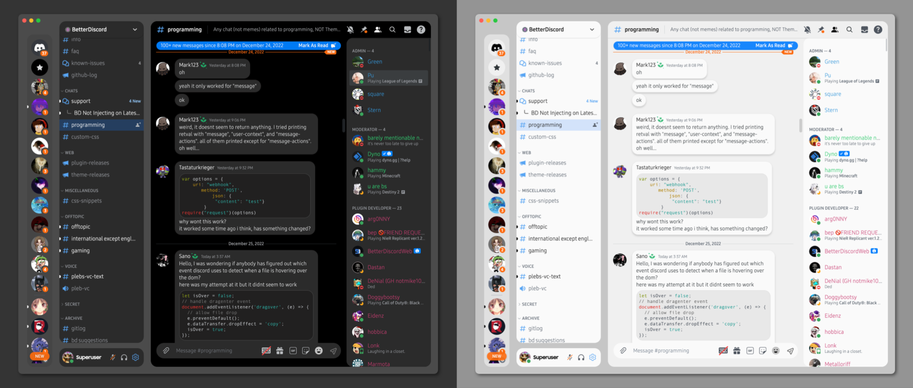

<h1 align=center>Unity</h1>

A OneUI inspired theme for Discord

> These are the defaults for the theme. For info on stuff you can customize, visit [the wiki.](https://github.com/joshuah345/Discord-Stuff/wiki/Themes)

## Features

- Light and Dark mode support
- Accent and Custom Colors
- Gaps between UI elements
- (Partial) Transparency
- Custom Backgrounds
- Blur
  
All of which are customizable!
